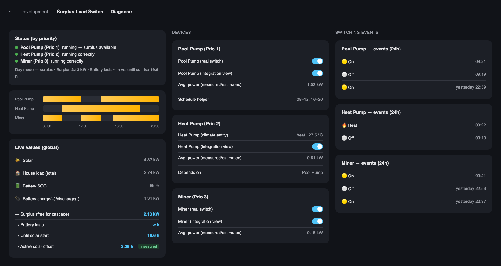

Home Assistant custom integration that switches devices on and off based on
your solar surplus — with a priority cascade for multiple devices, automatic
power measurement, and a battery-aware overnight mode. Works with any PV/battery
system that exposes the right sensors to Home Assistant, not tied to a
specific inverter brand.



*Example dashboard (anonymized demo data) showing three devices sharing one
solar surplus by priority, their status, and their switching history — built
with standard Lovelace cards on top of the integration's sensors.*

## Why

Most PV surplus automations only handle a single device with a fixed
threshold. This integration is built for households with several
controllable loads (crypto miners, heat pumps, pool pumps, ...) that should
compete for the same surplus by priority, without oscillating every time a
cloud passes over or another appliance briefly kicks in.

## Features

- **Priority cascade** — configure devices in priority order; the highest
  priority device gets first claim on available surplus, the next only sees
  what's left over.
- **Automatic power measurement** — optionally link a power sensor per
  device. The integration learns its real average consumption over the
  last 24 hours of *active* runtime — not 24 calendar hours — and uses that
  instead of a static estimate once enough data exists. Tracking active
  runtime rather than calendar time means a device that goes idle for a
  few days (e.g. a pool heat pump during a rainy stretch) doesn't lose its
  history and fall back to the static estimate right when it starts running
  again; it just keeps the last real samples until fresh ones replace them.
- **Battery-aware overnight logic** — devices stay on overnight if the
  battery has enough charge to last until solar production resumes the next
  morning (based on sunrise + a monthly offset, since raw sunrise isn't
  when solar actually becomes useful).
- **Self-calibrating solar-start offset** — that monthly offset isn't a
  fixed guess: it's learned per calendar month from this system's own solar
  production history (Home Assistant's long-term statistics), using only
  good-quality days — a day only counts if its peak production reaches 70%
  of the recent local peak, which filters out cloudy days using nothing but
  the system's own data (no external weather source needed). A month
  without enough good days yet borrows from a nearby calibrated month
  (offset changes gradually across the year) or falls back to a sane
  default, so coverage improves progressively over a year of real
  operation instead of requiring a full year before it helps at all.
  "Aktiver Solar-Offset" is a plain numeric sensor with a history showing
  the value actually in effect each day, and "Solar-Start Kalibrierung"
  is a diagnostic sensor showing how many months are calibrated and each
  month's value, sample size, and source (measured / borrowed / default).
- **Self-calibrating base-load floor** — the "unavoidable" load a battery
  projection assumes when nothing is managed used to floor at a hard 0 kW,
  which a real household never draws (fridge, standby electronics,
  networking gear). Several devices without a real power sensor fall back
  to a static config estimate, and whenever that briefly overshoots what
  the device is actually drawing, the floor kicked in and made the
  projection look more favorable than reality for that cycle. The floor is
  now the house's own raw, unmanaged-load sensor's minimum over the last 3
  days — a real physical measurement instead of an assumption — re-derived
  daily from Home Assistant's long-term statistics, with the same
  measured/none-yet fallback behaviour as the solar-start offset above.
  Visible as attributes on the "Grundlast" sensor.
- **Weekday/hour/house-mode load-profile learner (diagnostic)** —
  optionally point it at a house-mode helper (e.g. an `input_select`
  with values like "Zuhause"/"Abwesend"/"Schlafen"/"Urlaub") and it
  learns typical Grundlast per (weekday, hour, mode) combination — e.g.
  "Mondays at 22:00 while home, load is usually ~0.5 kW lower". Self-
  samples from the coordinator's own cycles rather than the recorder's
  history, since that's usually retained for far less than the trailing
  4 weeks this is meant to cover, and re-derives don't depend on knowing
  this install's specific Grundlast entity_id. Falls back to a coarser
  grouping (same hour+mode across all weekdays, then just the hour)
  until a given combination has enough daily samples of its own.
  Diagnostic only for now — visible on the "Lastprofil Wochentag/Modus"
  sensor's attributes — doesn't yet feed into any switching decision.
- **Spike-resistant** — the battery-margin projection uses a 20-minute
  rolling median of the discharge rate, so a stove or kettle running for a
  few minutes doesn't get projected forward as if it continued all night.
  How long the system waits before switching a device off also scales with
  how much battery margin is currently available. That smoothing window
  resets immediately whenever a managed device itself turns on or off —
  that's a real, known change in what's drawing power, not the kind of
  external noise the median is meant to filter, so it shouldn't take up to
  20 minutes to be reflected (e.g. a device's time window ending should
  free up its share of the battery margin right away, not gradually). The
  first reading right after that reset bridges to the last trusted value
  instead of being used on its own — right after a reset is exactly when a
  cloud sensor is most likely to still be catching up, and a single
  unsmoothed reading has no averaging protection at all.
- **Tolerant of brief sensor outages** — the four core sensors (solar,
  load, SOC, battery power) hold their last known good reading for up to
  20 minutes if one goes `unavailable`/`unknown`, instead of freezing the
  whole cascade on every short integration hiccup. A genuinely extended
  outage still correctly freezes rather than running forever on an
  increasingly stale number.
- **Wallbox support** — wallboxes with their own PV-surplus charging logic
  are added as a separate device type: never switched, only their power is
  subtracted from the household load so they don't distort the surplus
  calculation for other devices. Optionally, other devices can depend on a
  wallbox being "satisfied": either its own power draw has reached a
  configured threshold (it's already getting plenty), or — with no
  configuration needed beyond its required power sensor — it's been
  drawing near-zero power for the same hold time every other decision
  uses, which reads the same whether the car's finished charging or isn't
  even there. E.g. a pool heat pump can hold back until the car is no
  longer the priority.
- **Dynamic wallbox surplus reservation** — a wallbox can also reserve a
  share of the current surplus for itself before the device cascade
  competes for the rest, without blocking anything outright. Set the
  car's capacity, current-SOC, and target-SOC entities (e.g. from a
  Tesla/EV integration, or a spot-price charge scheduler add-on for
  capacity specifically — point at whatever already tracks it instead
  of re-entering a number by hand) and the reservation is computed
  fresh every cycle from how many kWh are still missing to the target
  and the current *shape* of the day: with an optional solar-forecast
  sensor configured (e.g. Forecast.Solar's "kWh still to come today"),
  the reservation claims the same share of whatever surplus is flowing
  right now as the deficit's share of today's forecast remaining
  production — low first thing in the morning when little is forecast
  yet, higher once the afternoon is genuinely delivering it. Without a
  forecast sensor configured, falls back to a flatter sunset-minus-a-
  safety-margin/hours-remaining rate — easing off on its own as the car
  approaches its target, and ramping up on its own if the deficit isn't
  closing. Capped at both the
  surplus that actually exists right now and the wallbox's own maximum
  charge rate — self-limiting rather than gated to a fixed time of day,
  so a large deficit that genuinely needs a full day to close isn't held
  back until some arbitrary starting point, while a small one doesn't
  claim more of the morning than it actually needs. The max-charge cap
  can be entered by hand, or left unset to self-learn from the 95th
  percentile of this wallbox's own power sensor's hourly maximums over
  the last 30 days (not the outright maximum — a single glitched-high
  hour otherwise poisons the cap for the rest of that window) — adjusts
  on its own as reality changes (3-phase summer charging vs. a
  single-phase winter fallback, a different car) instead of a number
  that quietly goes stale. An optional presence entity
  (a binary_sensor "plugged in" or a device_tracker) keeps the
  reservation from holding surplus back for a car that's simply not
  there — the SOC/target-SOC entities only ever hold the last known
  reading, which stays whatever it was when the car left. All optional;
  leaving the capacity or either SOC sensor unset disables the whole
  reservation. This is separate from and complements the weak-day
  priority above, which still applies unchanged on a detected weak day.
  The rate itself is computed from a smoothed (20-minute rolling
  median) surplus figure, not the raw instantaneous one, so it holds
  steady while the underlying deficit and time-remaining are themselves
  barely moving — a brief cloud, or the wallbox's own draw beating on a
  laggy few-minutes-stale house-load reading, no longer shows up as a
  swing in the reserved kW on the dashboard. And once the reservation
  has claimed essentially the entire surplus that exists (not merely a
  partial share of it — the wallbox is capped by availability, not by
  its own charge rate), other devices stop being allowed on purely
  because the house battery could afford to run them: that draw is
  exactly what a surplus-based wallbox charger would otherwise pick up
  the moment it's freed. A device with its own forced minimum runtime
  is unaffected and keeps its priority regardless. The gate itself
  releases with a delay (10 minutes of consecutively *not* being
  starved) rather than the instant the wallbox eases up — takes effect
  immediately going into the starved state, but on a partly-cloudy day
  a single clear gap releasing it right away would reset a device's own
  switch-on-cooldown before it ever finished counting down, and the
  device would end up never actually switching despite the wallbox
  being starved most of the time. The same starved state also changes
  what counts as surplus in the first place: normally the wallbox's own
  measured draw is excluded from the house's base load, since a
  genuinely self-limiting wallbox draws only what's left over anyway —
  but that assumption breaks the moment it isn't self-limiting (a
  manual "charge now" override on the charger's own side, for
  instance), and excluding its draw would then make the house look like
  it has surplus to spare when in reality that power is already
  spoken for. Once starved, the wallbox's full real draw counts as
  ordinary, unavoidable load ahead of every other device instead —
  effectively priority 0 — rather than only affecting the
  battery-affordability path above. "Starved" itself covers two
  independent cases, either one enough on its own: the forecast-based
  reservation needing essentially the whole day's remaining surplus, or
  — regardless of what the forecast says — the wallbox's real draw
  already exceeding what was actually reserved for it by more than
  plausible cross-algorithm noise. The second case exists because the
  reservation only ever protects up to its own calculated fair share;
  it has nothing to say about a wallbox that isn't limiting itself to
  that share at all, which the forecast-based case alone would miss
  entirely on a day it otherwise still comfortably covers the deficit
  on paper. What's actually protected while starved is the *larger* of
  the wallbox's real draw and its calculated reservation, not just the
  real draw — right after switching a wallbox back to surplus-following
  mode, its real draw can sit at ~0 for a few cycles while it ramps up,
  and protecting only that real draw would leave everything it's about
  to need looking completely free to every other device for as long as
  the ramp-up takes. A brief gap in the car's own SOC/target/capacity/
  presence entities (a flaky cloud API, for instance) bridges to the
  last successfully-computed reservation for a while rather than
  collapsing straight to 0 for that cycle — the same tolerance the core
  solar/load/SOC/battery sensors already get elsewhere for exactly this
  kind of transient outage.
- **Time-windowed devices** — restrict a device to a daily window (e.g. a
  pool pump); outside it, it's forced off immediately. Inside the window
  it's a normal cascade device — still only switched on when there's
  surplus (or battery margin) to cover it, so it won't cycle on/off just
  because the window is open. Point it at an existing `schedule.*` helper
  entity for multiple blocks per day / per-weekday schedules, or set a
  simple start/end time directly if you don't need that. The stability
  hold that normally delays switching on still runs *while the window is
  still closed* — a device that's already had enough surplus/battery
  margin for the full hold time before its window opens switches on the
  moment it does, instead of waiting out a fresh hold from zero after.
- **"Läuft nicht die ganze Nacht durch" switch for windowless devices** —
  a device with neither a schedule nor a window has no known stopping
  point, so the overnight battery projection has to assume (for safety)
  that it might keep drawing power all the way to solar start if switched
  on — which can make even a high-priority device fail the battery check
  outright, since its total worst-case energy need balloons over many
  hours, regardless of how little competition it actually has. Turning
  this per-device switch on caps that assumption at a rolling "at most
  DEFAULT_MAX_ASSUMED_RUNTIME_H (2h) hours from right now" instead —
  re-derived every cycle, so it keeps sliding forward while conditions
  stay good rather than being a one-shot commitment, and the device still
  gets shed immediately the moment it genuinely no longer fits, same as
  any other device. Off by default (original unbounded behaviour). Only
  takes effect when the device has no schedule/window configured — those
  already have a real, more precise stopping point and take priority over
  this (the switch's own attributes show whether it's currently having
  any effect).
- **Priority-graduated shedding** — when there isn't enough surplus or
  battery margin for everything, the lowest-priority device is shed first
  instead of every device switching off together. Each device's own
  "would the battery still last?" check accounts for every higher-priority
  device already committed ahead of it, so a lower-priority device drops off
  battery power sooner than a higher-priority one, rather than all of them
  sharing one global yes/no flag. Also staggers *how long* each waits before
  actually switching off — a rank's patience shrinks a bit further down the
  priority list, so several devices crossing their off-threshold in the same
  cycle (e.g. solar dropping off a cliff at sunset) still shed lowest-first
  instead of finishing their hold together and switching off as one.
- **Minimum daily runtime** — set an optional target (e.g. a pool pump that
  needs to filter for 4h/day for hygiene). It's never denied its normal
  chance to reach that for free on surplus/battery power earlier in the day.
  Forcing (potentially on grid power) kicks in from either of two triggers:
  with an optional solar-forecast sensor configured, as soon as this
  device's own remaining energy need already amounts to more than about
  half of *all* the solar the forecast still expects today — catching a
  visibly weak day around midday instead of only at dusk, before an
  under-charged battery gets drawn down further right when the coming
  night needs it most. Otherwise (or as a fallback either way, in case the
  forecast hasn't flagged trouble yet): once there's no longer enough time
  left to catch up for free — for a device with a configured time window,
  once the time remaining until the window closes is no longer enough for
  the still-missing hours plus a safety margin; for a device with no
  window at all, once today's solar peak has passed.
- **Per-device battery reserve** — set an optional SOC floor (%): once the
  battery drops below it, that device gets forced off to protect the
  reserve. This only ever cuts an already-running device off — it never
  blocks the device from turning on via genuine PV surplus, so a good day
  behaves exactly as before regardless of the floor. A device's own minimum
  daily runtime target, if any, may still dip into this reserve to make
  sure it gets met.
- **Climate-controlled devices** — some devices (e.g. a pool heat pump) have
  no on/off switch at all, only a thermostat-style mode selector
  (off/heat/cool/auto). Add these as a climate-controlled device: pick the
  `climate.*` entity and which mode counts as "on" (e.g. `heat`) — the
  cascade otherwise treats it exactly like a switch-controlled device
  (priority, power measurement, time windows, minimum runtime all apply).
  One difference: a compressor wears out measurably faster from frequent
  short cycles than from the same total runtime in fewer, longer ones — a
  resistive load (boiler, pump) doesn't have that problem, so this only
  applies to climate devices. Both the on-hold and the off-hold (and how
  far ahead of a schedule window pre-charging starts) are automatically
  doubled for any device added this way, so the same surplus swings that
  are fine to chase for a boiler switch fewer times a day for a heat pump.
- **Device dependencies** — some devices physically can't do anything unless
  another one is already running (e.g. a heat pump with a flow switch that
  only lets the compressor start while its pool pump is circulating water).
  Mark a device as depending on another; it's only ever turned on while the
  prerequisite is also on, so it never wastes a cascade reservation or
  dilutes its own power measurement with idle-but-"on" time. Same
  pre-charging as time windows: if surplus/battery margin already qualified
  it while the prerequisite was still off, it switches on the instant the
  prerequisite does instead of waiting out a fresh hold afterward.
- **Per-device enable switch** — each device gets an "Aktiviert" switch
  entity. Turning it off takes the device out of the cascade entirely and
  makes the integration hands-off for it — no forced on or off, so it's
  free for manual or other-automation control — without touching its
  configuration, historical power average, or daily-runtime data. It picks
  up right where it left off once re-enabled.
- **Decision log** — every cascade cycle, for every device, the integration
  records the real reasoning behind that cycle's decision (outside its
  time window, an unmet dependency, disabled, minimum runtime being
  forced, surplus/battery numbers, or unchanged in the hysteresis dead
  zone) — both as a Home Assistant logbook entry and in a rolling
  in-memory table (last 1000 entries) exposed as a sensor attribute, so
  it's possible to see *why* the cascade decided what it did every time it
  ran, not only when something changed. The example dashboard's Logs tab
  renders that table as Datum/Gerät/Titel/Details columns.
- **Switch countdown** — a per-device sensor shows seconds remaining
  before its next pending switch action actually fires (either direction),
  and a "next check" timestamp sensor shows when the coordinator will
  re-evaluate everything — so a device that's still holding out its
  stability buffer reads as "waiting X minutes", not as a stuck deviation.
- **Weak-day detection** — compares the battery's SOC gain since solar
  start today against the solar-start calibration's learned normal gain
  for this time of year (once late enough in the morning that a strong
  day would already show it), falling back to a simple median of the
  last 14 days whenever the current month isn't calibrated yet. SOC gain
  (not raw solar power) is used since it's naturally smoothed by the
  battery's own charging — a brief sun break through passing clouds
  barely moves it — and it already accounts for household consumption
  along the way. A wallbox can be given an effective priority "for weak
  days only" even though it's never itself switched or ranked otherwise
  — on a day running well below normal, any device at or worse than that
  priority gets held back entirely until the battery's nearly full, so a
  car that still needs it gets first claim on a scarce day. The block
  releases as soon as the wallbox itself no longer needs the surplus —
  same idle/threshold "satisfied" detection as the wallbox-dependency
  feature, so it works whether the car finished charging or was never
  plugged in — rather than holding other devices back for nothing while
  the surplus would otherwise just go unused to the grid. Optional and
  off by default.
- **Will the battery reach full in time?** — a forward-looking
  counterpart to weak-day detection above, which only ever looks
  backward at today's gain so far. Projects from the *current* live
  charge rate whether the battery is on track to reach its "essentially
  full" threshold by sunset minus a safety margin — a "Akku wird
  rechtzeitig voll" binary sensor, with the missing kWh and both hour
  figures as attributes. Not diagnostic-only: whenever it's off during
  the day (the battery isn't gaining charge fast enough to make the
  target), the battery-affordability path is blocked the same way the
  wallbox-starved gate above blocks it — a device otherwise granted "on"
  purely because the battery could afford it would be drawing power the
  battery itself is behind on needing. force_runtime is unaffected
  either way. Same debounced-release shape as the wallbox gate. Only
  evaluated while the sun is above the horizon — at night, or before the
  morning charge has ramped up, the battery not gaining charge is
  completely normal, not a sign of anything behind schedule.

  Beyond blocking the battery-affordability path, a behind-schedule
  battery also gets an active reservation of its own — the same kind of
  forward-looking claim on surplus the wallbox already gets ("Akku
  reserviert" sensor), not just a veto on other devices leaning on the
  battery. Without this, a device with genuine *live* surplus (not
  battery affordability) would keep consuming it in full on a cloudy
  day while the battery itself fell further behind. Full priority over
  every managed device while behind schedule, not a calculated pace or
  a proportional "fair share" — claims whatever surplus remains once
  the wallbox has already taken its own share (the wallbox's claim is
  never reduced to make room for this), mirroring wallbox_starved's own
  aggressiveness exactly. A minimum daily runtime already in progress
  is the one exception: it's never overridden, by design, the same as
  everywhere else force_runtime applies. Requires no per-priority-tier
  logic of its own: subtracting the reservation from the surplus pool
  naturally cascades through the existing priority-ordered device loop
  the same way any shrinking surplus already does — every non-forced
  managed device simply sees nothing left over while this is active.
- **One Home Assistant device per configured device** — each configured
  device (Miner, Boiler, ...) gets its own device card under Settings →
  Devices & Services, nested under the integration's hub device, instead of
  every entity piling into one flat list — keeps entity names short (e.g.
  "Ø Leistung" rather than repeating the device and integration name in
  every entity).
- Fully configurable through the Home Assistant UI (no YAML required).

## Requirements

Your PV/battery system needs to expose, as Home Assistant entities:

- Solar production power (kW)
- House load power (kW)
- Battery state of charge (%)
- Battery charge/discharge power (kW) — **negative = discharging**

## Installation

### Via HACS (recommended)

1. HACS → Integrations → ⋮ → Custom repositories
2. Add this repository URL, category "Integration"
3. Install "Surplus Load Switch"
4. Restart Home Assistant

### Manual

Copy `custom_components/surplus_load_switch` into your `config/custom_components/` folder and restart Home Assistant.

## Configuration

1. Settings → Devices & Services → Add Integration → "Surplus Load Switch"
2. Select your solar, load, SOC and battery power sensors, battery capacity, and minimum SOC
3. Right after setup (or later via the integration's Configure menu), add devices:
   - **Switchable device** (e.g. a miner): name, switch entity, priority, estimated power, optional power sensor for automatic measurement
   - **Climate-controlled device** (e.g. a pool heat pump with no on/off switch): name, climate entity, which hvac_mode counts as "on", same priority/power/window/runtime options as a switchable device
   - **Wallbox**: name and power sensor only — never switched, just subtracted from the load

Priority determines serving order (1 = highest). Use "Edit device" to change
priority or other values later, and "Remove device" to delete one.

### Adjusting settings afterwards without the Configure dialog

Adding a new device still goes through the Configure menu above (it's a
guided, multi-step form — better suited to that than a dashboard tile), but
changing an existing device's settings afterwards doesn't have to. Every
device also gets a set of live entities for its everyday-tunable values —
priority, estimated power, minimum daily runtime, which switch/climate
entity it controls, its power sensor, its schedule helper, and its
dependency — plus global ones for the four core sensors and battery
capacity. Add these to any dashboard (or use the self-adapting example
dashboard below, which already includes them) and edit them the same way
as any other number/select entity, including through automations or
scripts if you want to change something on a schedule.

Each configured device also has its own Home Assistant device (Settings →
Devices & Services → Surplus Load Switch → the device's name), grouping
all of its own entities — including the ones above — onto one page. The
example dashboard's Einstellungen tab links straight there per device
instead of duplicating every field across several cards.

## Example dashboard

[`dashboard_diagnose.yaml`](dashboard_diagnose.yaml) is a diagnostics
dashboard showing the same kind of view as the screenshot above — and it
self-adapts to however many devices you've configured. Add or remove a
device in the integration's Configure menu and this view picks it up on
its own; there are no per-device entity IDs to fill in, since it
discovers everything through the consistent naming pattern this
integration always uses (`sensor.surplus_load_switch_*`), not hardcoded
references. The status card (built entirely from core Home Assistant
templating) works standalone; the device-overview and logbook cards use
the free [auto-entities](https://github.com/thomasloven/lovelace-auto-entities)
HACS card to stay dynamic — install that first if you don't already have
it. Paste the file into a new dashboard (or a new view on an existing
one) via Settings → Dashboards → "Edit in YAML".

## How the decision logic works

Every 60 seconds, for each switchable device (highest priority first):

```
remaining_surplus = available_surplus - sum(power already reserved by higher-priority devices)
battery_would_last = would the battery still cover the time until next solar start
                      if this device — plus every higher-priority device already
                      committed — draws its predicted power, with whatever isn't
                      covered by surplus coming from the battery?
should_on  = remaining_surplus > device_power + 0.2 kW   OR   battery_would_last
should_off = remaining_surplus < device_power - 0.2 kW   AND  NOT battery_would_last
```

`device_power` is the measured 24h-active-runtime average (once ≥20 samples exist) or the
configured estimate. No switching decision fires off a brief few-minute
fluctuation: an ON decision must hold for 10 minutes before it's acted on,
and an OFF decision's required hold time scales from 10 minutes (no battery
margin to spare — react as fast as the floor allows) up to 20 minutes (4h+
margin — likely a transient spike, safe to wait it out), then shortens
further by 1 minute per priority step below the highest, never below the
10-minute floor — so if several devices cross their off-threshold in the
same cycle (e.g. solar drops off a cliff at sunset), the lowest-priority one
still finishes its hold and switches off first, just not any faster than 10
minutes.

During actual daylight (sun above the horizon), the battery projection also
caps its look-ahead at a short fixed horizon instead of "hours until solar
resumes" — once today's calibrated solar-start threshold has already
passed, that figure points at tomorrow's, which would otherwise make a
passing cloud at noon look exactly like "no more sun for 23 hours" and
justify shedding devices over a temporary dip. The full overnight horizon
only applies once the sun has actually set.

`battery_would_last` is evaluated per device, projecting forward instead of
reading the *current* discharge trend — turning a device on doesn't make it
appear to break its own battery budget a few minutes later once it actually
starts drawing power, and a lower-priority device sheds before a
higher-priority one when there isn't enough margin for both, rather than
every device sharing one global "is the battery discharging right now" flag.

The projection is also time-window-aware: a committed device with a known
cutoff — its own time window/schedule helper's next off-time, or inherited
from a prerequisite it depends on — drops out of the projected load at that
point instead of being assumed to draw power all the way to solar start.
Otherwise a lower-priority device's battery projection stays needlessly
pessimistic once a higher-priority windowed device (e.g. a pool pump that
stops at 20:00 regardless) is due to switch off anyway.

Each device's power-tracking sensor exposes the real decision as
attributes — `sollte_an_sein` (what the cascade currently wants: on/off)
and `korrekt_geschaltet` (whether the real device state matches that) — so
a dashboard can show the actual verdict instead of reimplementing an
approximation of the logic that can drift out of sync as the logic evolves.

Each device also gets an "— Abschalt-Puffer" ("off buffer") sensor showing,
in seconds, how much longer an active off-decision needs to hold before it's
acted on — 0 while the device isn't currently counting down toward being
turned off.

"Akku reicht" ("battery would last") and the day/night mode sensor use this
same time-window-aware projection too, not a flat avail_kwh / current
discharge-rate division — a device with a known cutoff dropping out of the
load shortens the effective drain rate for the rest of the projection, so
this number reflects what the cascade actually expects to happen rather
than looking like a shortfall right up until that cutoff.

If your house-load and battery-discharge sensors come from a
cloud-polled integration with its own update lag (a few minutes isn't
unusual), a device turning off can briefly look like a spike in
unmanaged base load and discharge — the sensors still report the
pre-transition totals, and since the device you just turned off is no
longer subtracted from them, that lingering reading gets misattributed
to "everything else". This would otherwise show up as a sudden,
unexplained battery-margin drop and can shed a lower-priority device
right as a higher-priority windowed device's cutoff should have made
things easier, not harder. After any managed device's on/off state
changes, the pre-transition power figure is used instead of the fresh
one for this calculation, until both sensors have each produced at
least 2 genuinely new readings since the change — real evidence they've
caught up, rather than guessing a fixed delay — capped at 10 minutes in
case a sensor stalls and never reaches that count.

If any of the four core sensors (solar, load, SOC, battery power) reports
`unavailable`/`unknown`, the coordinator skips that update cycle entirely
instead of treating the missing value as 0 — a brief sensor hiccup on the
solar sensor would otherwise look exactly like "no sun" and could switch
devices off. The last known data is kept until the sensor recovers, and all
of this integration's own entities keep showing that last-known state too
(rather than going `unavailable` themselves) for as long as the skip
continues.

## License

MIT
